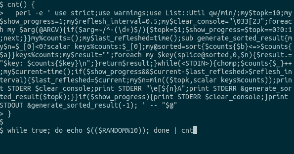

count.pl
=====

<a href="https://github.com/oshikiri/count.pl/actions?query=workflow%3Atest">
  
</a>




## How to use

Load `cnt` function

```sh
cnt() {
  perl -e ' use strict;use warnings;use List::Util qw/min/;my$topk=10;my$show_progress=1;my$reflesh_interval=0.5;my$clear_console="\033[2J";foreach my $arg(@ARGV){if($arg=~/^-(\d+)$/){$topk=$1;$show_progress=$topk==0?0:1;next;}}my%counts=();my$last_refleshed=time();sub generate_sorted_result{my$n=$_[0]<0?scalar keys%counts:$_[0];my@sorted=sort{$counts{$b}<=>$counts{$a}}keys%counts;my$result="";foreach my $key(splice@sorted,0,$n){$result.="$key: $counts{$key}\n";}return$result;}while(<STDIN>){chomp;$counts{$_}++;my$current=time();if($show_progress&&$current-$last_refleshed>$reflesh_interval){$last_refleshed=$current;my$n=min(($topk,scalar keys%counts));print STDERR $clear_console;print STDERR "\e[${n}A";print STDERR &generate_sorted_result($topk);}}if($show_progress){print STDERR $clear_console;}print STDOUT &generate_sorted_result(-1); ' -- "$@"
}
```

and redirect newline-separeted data into `cnt`.

```sh
echo -e 'a\nb\na\nb' | cnt
```

It will show counts.

```
a: 2
b: 2
```

## Requirements

- Perl v5.30.0 (?)

```sh
# For development
cpanm Perl::Tidy
```

## Development

```sh
# Format count.pl
make format
```


## Reference

- scount https://github.com/oshikiri/scount
  - Equivalent implementation in Golang
